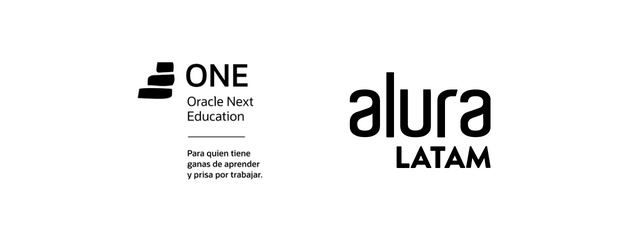

# Exchanger ONE

p

As part of the development program offered by
[Oracle Next Education](https://www.oracle.com/mx/education/oracle-next-education/)
and [Alura Latam](https://www.aluracursos.com/), one of the proposed challenges is to create a 
currency converter.

The project is a Java desktop application that allows users to 
convert units of currency, including USD, EUR, and MXN, 
as well as temperature in both Celsius and Fahrenheit. 

The application is built using Maven and features a graphical 
user interface created with [JavaFX](https://openjfx.io/).

--- 

Dentro del programa de desarrollo de [Oracle Next Education](https://www.oracle.com/mx/education/oracle-next-education/) y 
[Alura Latam](https://www.aluracursos.com/) uno de los desafíos o _challenges_ que se proponen
es un convertidor de monedas.

El proyecto es una aplicación de escritorio que convierte unidades
de moneda USD, EUR, MXN y temperatura C y F. Está hecho en Java con
el kir de interfaces gráficas [JavaFX](https://openjfx.io/), 
construido con Maven.